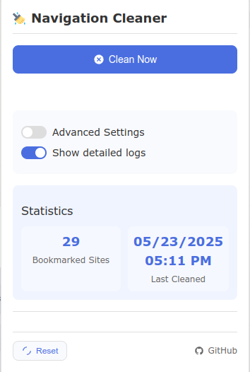
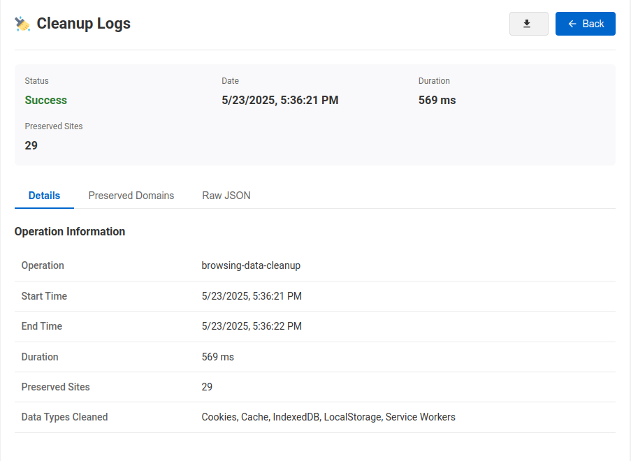

# Clean Browser Extension

The Clean Browser extension provides a simple and efficient way to clear browsing data while ensuring that data from bookmarked sites is preserved. The extension removes all browsing data, including history, cache, and cookies, except for data related to bookmarked sites. By clicking the "Clean" button, users can quickly remove the specified browsing data, enhancing their privacy and security while maintaining access to their favorite sites. The extension is designed to be user-friendly and requires no technical expertise.

## Screenshoot

  

    <h3>Popup</h3>
    
  

  

    <h3>logs</h3>
    
  

